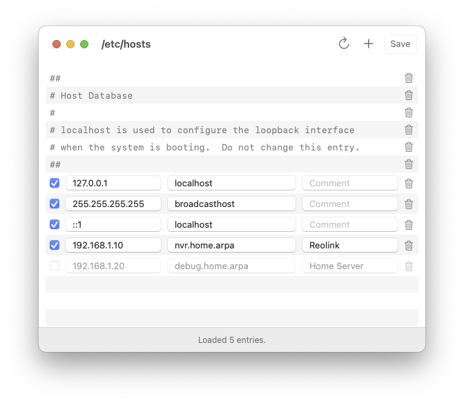

<div align="center">
	<picture>
		<source media="(prefers-color-scheme: dark)" srcset=".readme/dark.png" />
		<source media="(prefers-color-scheme: light)" srcset=".readme/light.png" />
		
	</picture>
</div>

### Install

```shell
cd /Applications
rm -rf Hosts.app

git clone git@github.com:navtoj/Hosts.app
open -a Hosts
```
